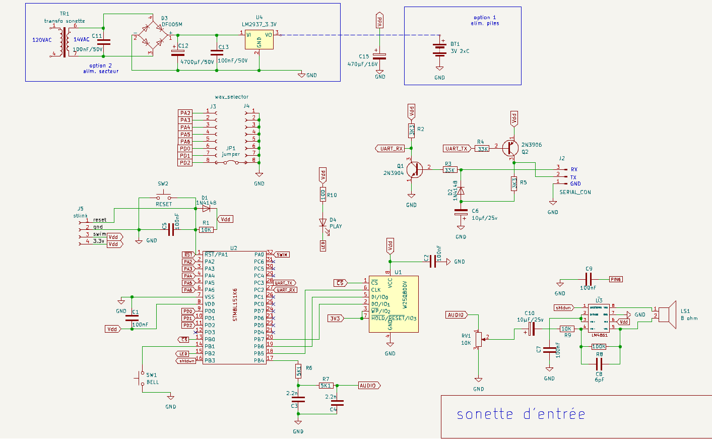

# sonette de porte réalisée avec un STM8L151K6

Ce projet utilise le convertisseur Numérique/Analogique du MCU __STM8L151K6__  pour jouer un fichier au format __WAV__ enregistré dans une mémoire FLASH Windond __W25Q80DV__.  L'application est entièrement écrite en [smallForth](https://github.com/Picatout/smallForth) et comprend les 4 fichiers suivants:
1.  [exist.f](forth/exist.f)
1.  [w25q_prog.f](forth/w25q_prog.f)
1.  [play_wav.f](forth/play_wav.f)
1.  [door-bell.f](forth/door-bell.f) 


## Schématique du circuit



## Utilisation des périphériques du STM8L151K6

1. Le __DAC__ convertie les échantillons PCM du fichier __WAV__ en signal de sortie analogique.
1. La minuterie __TIMER4__ est programmée pour cadencer le transfert des échantillons PCM au __DAC__ à la fréquence requise de 22050 Hertz.
1. Le canal 3 du __DMA__ transfert les échantillons du tampon RAM vers le __DAC__ et génère une interruption à mi-chemin ainsi qu'à la find du tampon. 
1. Le __SPI__ fait la lecture du fichier __WAV__ qui est sur la __W25Q80DV__ vers le tampon. La moitié du tampon est chargée tandis que le __DMA__ transfert l'autre moitié au __DAC__. Cette technique permet un transfert continu sans délais entre échantillons.

## Montage 


## Programmation du MCU 

1.  Utiliser un programmeur STLINK_V2 pour installer le firmware  [smallForth](build/stm8l151k6/smallForth.bin) avec la commande. 
```
stm8flash -c stlinkv2 -p stm8l151k6 build/stm8l151k6/smallForth.bin
```
1. smallForth communicque avec l'utilisateur via un émulateur de terminal. J'utilise GTKTerm sur Ubuntu 22.04LTS. La configuration du terminal est __115200 BAUD,8 bits,1 stop, pas de parité, pas de contrôle de flux.__ Voir la schématique pour l'agencement du connecteur __serial_con__. 
1. Le reste de la programmation se fait avec le script [prog_sonette.sh](prog_sonette.sh) qui envoie les 4 fichiers forth de l'application à la carte. Cette opération prend quelques minutes. On voit le texte du code source défilé à l'écran et sur le terminal.
```
./prog_sonette.sh
```
3. Ensuite il faut programmer les fichiers __WAV__ dans la mémoire FLASH  __W25Q80DV__.  Il y en a 8 a programmer et ça prend entre 3 et 5 minutes par fichier en utilsant le script [send.sh](send.sh). Encore une fois on voit le texte défilé sur les 2 moniteurs pendant la programmation. Les 8 fichiers sont:
    1. [big-ben.hex](big-ben.hex), joue le Westminster quarter chime.
    1. [code-et.hex](code-et.hex), joue le code ET du film rencontre du 3ième type. 
    1. [gong.hex](gong.hex), joue un son de gong. 
    1. [jeux-interdits.hex](jeux-interdits.hex), joue la musique thème du film les jeux interdits.
    1. [kongas.hex](kongas.hex), joue des tambours Africains.
    1. [koro.hex](koro.hex),  joue le thème Korobeiniki de la version originale de Tétris. 
    1. [ode_joie.hex](ode_joie.hex), Joue l'hymne Européen.
    1. [romans.hex](romans.hex), joue des trompettes romaines.
 
 Tous ces fichiers sont échantillonnés à __8 bits non signés PCM à la fréquence de 22050 hertz__ et convertie en fichier texte par le script [bin2txt.sh](bin2txt.sh). J'ai utilisé le logiciel Audacity pour extraire des séquence de 4 ou 5 secondes et pour exporter sous le format requis par ce projet. Une ligne supplémentaire est ajoutée manuellement au début de chaque fichier. Il s'agit de la commande forth:
 ```
 PROG_BUFF  ud1 ud2 RX_FILE 
 ```
 * **ud1** est un entier double (32 bits) représentant l'adresse W25Q80DV où doit-être enregistré ce fichier. La partie faible précède la partie lourde.
 * **ud2** est un entier double représentant la taille du fichier WAV en octets. Ce nombre doit aussi être entré en format *little indian* à la place des 4 zéros de la deuxième ligne. Tous les nombres sont représentés en hexadécimal. Voici en exemple les 2 premières ligne du fichier [gong.hex](gong.hex)
 Les 12 premiers octets de la deuxième ligne représente le nom du fichier en ASCII. Si le nom a moins de 12 caractères des espaces , caractère ASCII __20__, comble le champ. Ainsi représenté **GONG** est **47 4F 4E 47**  suivit de 8 espaces pour combler le champ.
 ```
 PROG_BUFF $8000 8 $EB50 2 RX_FILE
 47 4F 4E 47 20 20 20 20 20 20 20 20 50 EB 02 00
 ```
Le fichier sera donc programmé à l'adresse __0x88000__ sur la __W25Q80DV__ et la taille du fichier est de __0x2EB50 octets.__ Notez les 4 derniers octets de la 2ième ligne __50 EB 02 00__  c'est encore la taille du fichier saisie au format *little indian*. 

Donc lorsque ces fichiers __HEX__ sont formattés correctement on utilise le script [send.sh](send.sh) comme suit:
```
./send.sh nom_du_fichier
```

La dernière étape est de configuré l'autorun pour que l'application démarre automatique lors de la mise sous tension du circuit. dans la console forth il suffit de faire:
```
AUTORUN DOOR-BELL
```
Redémarrez le MCU en pesant sur le bouton __RESET__. Au démarrage l'application laisse à l'utilisateur 5 secondes pour annuler l'application. Presser n'importe quel touche au clavier annule l'exécution de __DOOR-BELL__ avec retour sur la ligne de commande du forth.


